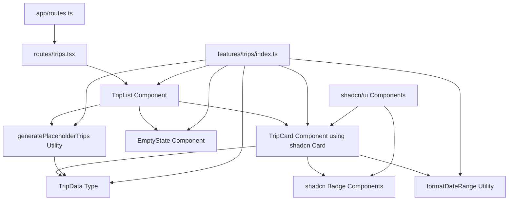

# Design Document - Trip Index

## Overview

The trip index page provides a clean, interface for browsing all user trips. This foundational feature establishes the UI patterns and data structures that will be extended for trip creation, editing, and management. The design leverages React Router v7's file-based routing and TailwindCSS for styling, following the established project patterns while creating reusable components for future features.

## Steering Document Alignment

### Technical Standards (tech.md)

- **React Router v7**: Uses file-based routing with a new `/trips` route
- **TypeScript**: Strict type safety for all trip data structures and component props
- **TailwindCSS**: Utility-first styling consistent with existing app.css patterns
- **shadcn/ui**: Leverages high-quality, accessible component library for consistent design
- **Component Architecture**: Follows functional component pattern established in `welcome.tsx`
- **Feature-based Organization**: Creates `features/trips` directory following documented structure
- **Pure Functions**: Placeholder data generator and date formatting utilities

### Project Structure (structure.md)

- **Route Organization**: New `app/routes/trips.tsx` following existing `home.tsx` pattern
- **Feature Directory**: `app/features/trips/` with components, types, and utils subdirectories
- **Component Naming**: PascalCase for components (`TripCard.tsx`, `TripList.tsx`)
- **Import Organization**: External libs, internal utils, feature imports, local imports
- **Testing Structure**: Mirror in `__tests__/features/trips/` and write an e2e test

## Code Reuse Analysis

### Existing Components to Leverage

- **Layout Structure**: Reuse `root.tsx` layout with `<Outlet />` for consistent page structure
- **shadcn/ui Components**: Use Card, Badge, Button components for consistent design system
- **CSS Classes**: Extend existing dark mode classes and TailwindCSS theme from `app.css`
- **Error Handling**: Leverage `ErrorBoundary` pattern from `root.tsx`
- **Meta Function**: Follow `meta()` pattern from `home.tsx` for SEO

### shadcn/ui Components to Install and Use

- **Card**: Use for trip display
- **Button**: For any interactive elements and navigation
- **Badge**: Display trip status or categories
- **Skeleton**: Loading states for trip cards

### Integration Points

- **Routing System**: Extends `app/routes.ts` with new trip index route
- **Global Styles**: Uses established Inter font family and dark/light mode support
- **Build Pipeline**: Integrates with existing Vite/React Router build process
- **Type System**: Builds on existing TypeScript configuration
- **shadcn/ui Setup**: Requires shadcn CLI installation and component setup

## Architecture

The trip index follows a component-based architecture with clear separation of concerns:



## Components and Interfaces

### TripList Component

- **Purpose:** Main container component that renders the list of trips and handles empty states
- **Props:** `trips: TripData[]`
- **Interfaces:**
  - Accepts array of trip data
  - Renders TripCard components or EmptyState
- **Dependencies:** TripCard, EmptyState, TripData type
- **Reuses:** CSS Grid for responsive layout, shadcn container patterns

### TripCard Component

- **Purpose:** Individual trip display component showing key trip information using shadcn Card
- **Props:** `trip: TripData`
- **Interfaces:**
  - Uses shadcn/ui components
  - Displays trip title, destinations with flags, date range
  - Hover effects and interactive states
- **Dependencies:** TripData type, formatDateRange utility, shadcn Card components
- **Reuses:** shadcn Card system, Badge for destinations, built-in accessibility

### EmptyState Component

- **Purpose:** Friendly message when no trips exist, using shadcn design patterns
- **Props:** None
- **Interfaces:** Static display component with shadcn typography
- **Dependencies:** None
- **Reuses:** shadcn typography utilities and consistent spacing patterns

### Route Component (trips.tsx)

- **Purpose:** Route-level component that provides trip data and renders TripList
- **Interfaces:** React Router route with meta function
- **Dependencies:** TripList, generatePlaceholderTrips
- **Reuses:** Route meta pattern from home.tsx

## Data Models

### TripData Type

```typescript
interface TripData {
  id: string; // Unique identifier
  title: string; // Trip name/title
  destinations: string[]; // Array of destination names
  departureDate: Date; // Trip start date
  returnDate: Date; // Trip end date
  flagEmojis: string[]; // Country flag emojis for destinations
}
```

### PlaceholderData

```typescript
// Static placeholder trips for development
const PLACEHOLDER_TRIPS: TripData[] = [
  {
    id: "1",
    title: "European Adventure",
    destinations: [
      {
        location: "Paris",
        flag: "🇫🇷"
      },
      {
        location: "Rome",
        flag: "🇮🇹"
      }
    ]
    departureDate: new Date("2024-06-15"),
    returnDate: new Date("2024-06-30")
  },
  // Additional placeholder entries...
];
```

## User Interface Design

### Layout Structure

- **Container**: Centered container with max-width for readability
- **shadcn Cards**: Use `Card` component with built-in styling and accessibility
- **Card Layout**: `CardHeader` for trip title, `CardContent` for details
- **Badge System**: shadcn `Badge` components for destinations with flag emojis
- **Typography**: shadcn typography utilities with Inter font family
- **Spacing**: shadcn spacing system ensuring consistent design language

### Dark Mode Support

- **shadcn theming**: Built-in dark mode support through shadcn's CSS variable system
- **Card theming**: shadcn Cards automatically adapt to light/dark themes
- **Badge theming**: shadcn Badges use semantic color variants that respect theme
- **Consistent experience**: All shadcn components follow the established theme system

## Error Handling

### Error Scenarios

1. **No Trip Data Available**
   - **Handling:** Display EmptyState component with helpful message
   - **User Impact:** Clear guidance about empty state, potential call-to-action

2. **Invalid Date Formatting**
   - **Handling:** Fallback to "Invalid Date" display
   - **User Impact:** Graceful degradation, no broken UI

3. **Missing Destination Data**
   - **Handling:** Display placeholder text "Destination TBD"
   - **User Impact:** Consistent layout maintained

## Testing Strategy

### Unit Testing

- **TripCard Component**: Render with mock data, verify all elements display
- **TripList Component**: Test with empty array, single trip, multiple trips
- **EmptyState Component**: Verify message and styling render correctly
- **Utility Functions**: Test date formatting edge cases and flag emoji mapping

### Integration Testing

- **Trip Route**: Full page render with placeholder data
- **Navigation**: Verify route integration with existing router setup

### End-to-End Testing

- **Navigation Flow**: User navigates from home to trips page
- **Dark Mode Toggle**: Theme switching maintains functionality
